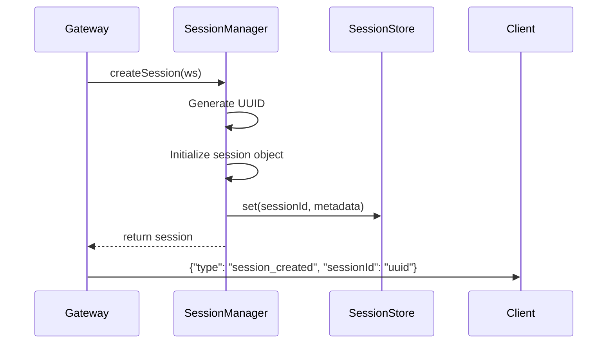
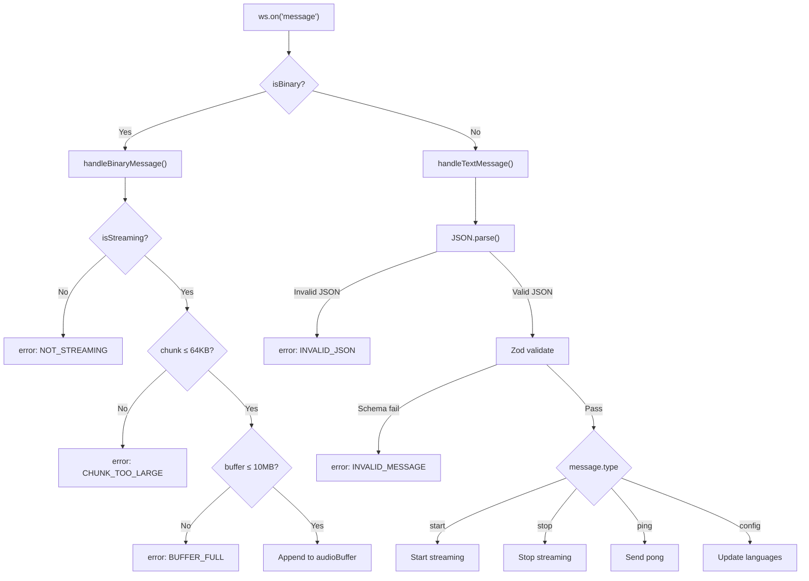
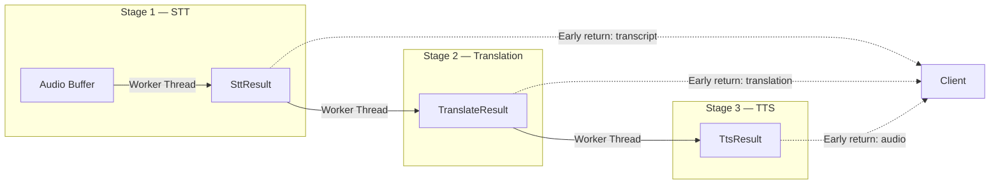
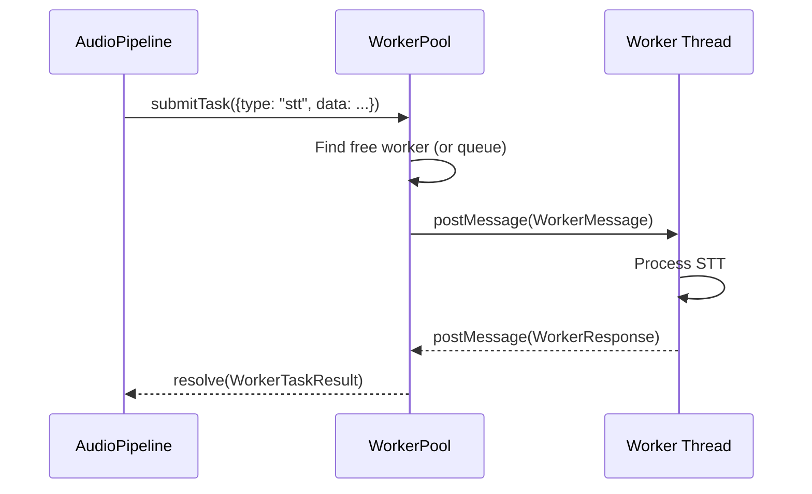
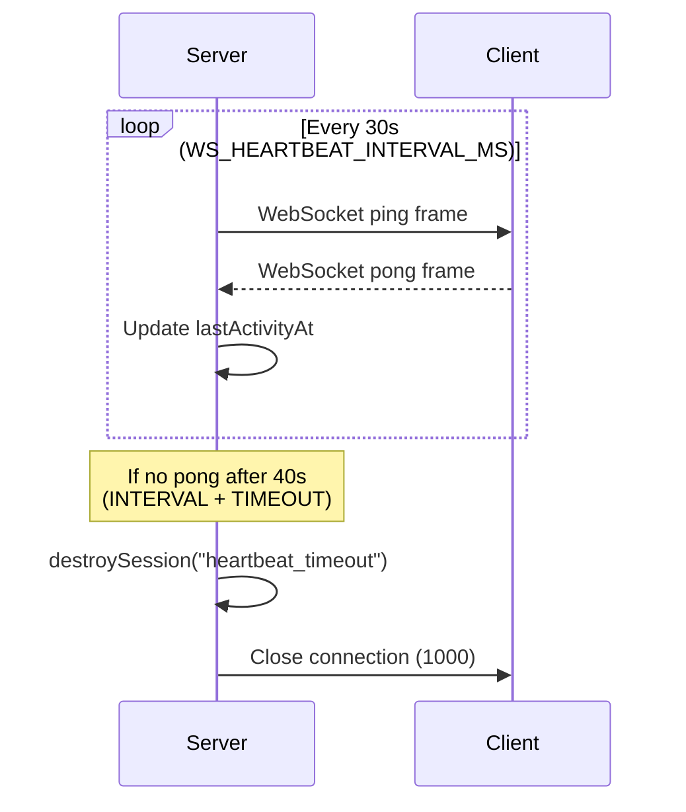
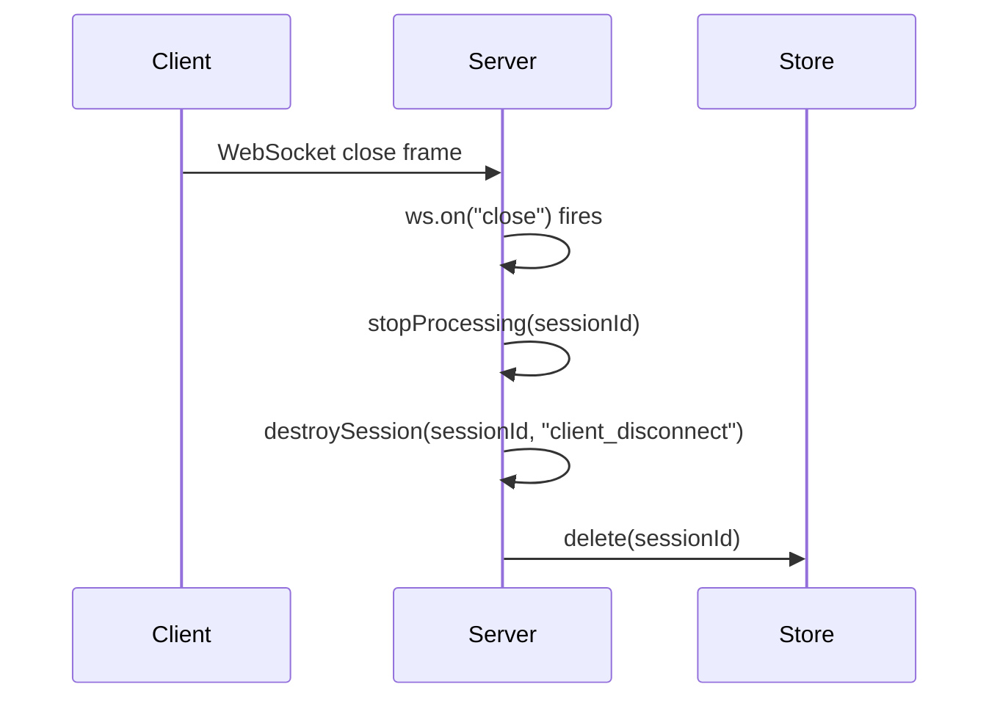
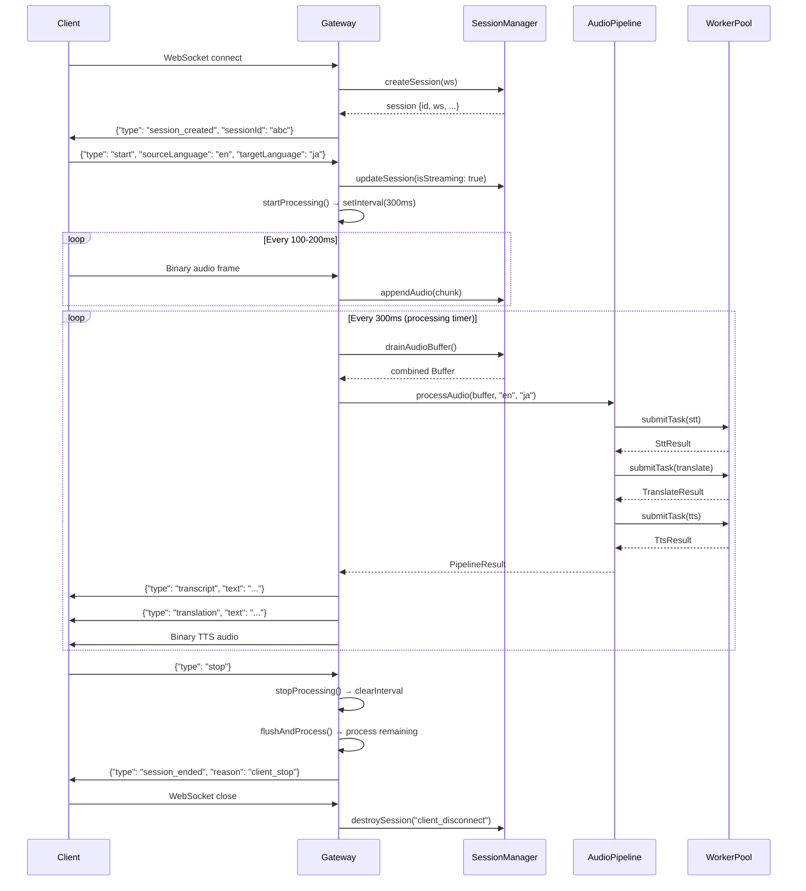
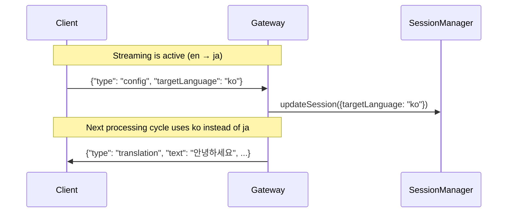
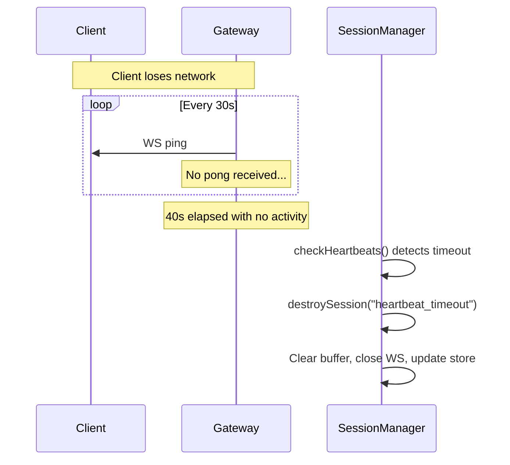

# WebSocket Flow — Detailed Explanation

This document traces every step of a WebSocket connection through the VoiceWorker server, from the initial TCP handshake to audio processing and graceful disconnect.

---

## Table of Contents

1. [Connection Lifecycle](#1-connection-lifecycle)
2. [Session Creation](#2-session-creation)
3. [Message Routing](#3-message-routing)
4. [Audio Streaming Flow](#4-audio-streaming-flow)
5. [Processing Pipeline](#5-processing-pipeline)
6. [Result Delivery](#6-result-delivery)
7. [Heartbeat & Keep-Alive](#7-heartbeat--keep-alive)
8. [Disconnect & Cleanup](#8-disconnect--cleanup)
9. [Error Handling](#9-error-handling)
10. [Sequence Diagrams](#10-sequence-diagrams)

---

## 1. Connection Lifecycle

### Entry Point

The Electron client opens a WebSocket connection to `ws://host:3200/ws`.

```
Client                         Server
  │                              │
  ├── HTTP Upgrade GET /ws ─────►│  Fastify receives the request
  │                              │  @fastify/websocket upgrades to WS
  │◄── 101 Switching Protocols ──┤  
  │                              │
  │    WebSocket connection is   │
  │    now established           │
  │                              │
```

**Where in the code:**

The Fastify route in [`app.ts:101`](file:///c:/Me/Cubie/VoiceWorker/src/server/app.ts#L101-L107) catches the upgrade and delegates to the gateway:

```typescript
app.get("/ws", { websocket: true }, (socket, _req) => {
  void wsGateway.handleConnection(socket);
});
```

### Pre-connection Checks

Before the WebSocket is even opened, two layers protect the server:

| Layer | Mechanism | Config |
|-------|-----------|--------|
| **Rate Limiting** | `@fastify/rate-limit` plugin | `RATE_LIMIT_MAX` requests per `RATE_LIMIT_WINDOW_MS` |
| **Payload Limit** | `maxPayload` on the WS server | `WS_MAX_PAYLOAD_BYTES` (default 1 MB) |

---

## 2. Session Creation

Once the WebSocket is open, [`gateway.ts:44`](file:///c:/Me/Cubie/VoiceWorker/src/websocket/gateway.ts#L44-L106) kicks off session creation:



### What Gets Created

The SessionManager ([`session-manager.ts:45`](file:///c:/Me/Cubie/VoiceWorker/src/sessions/session-manager.ts#L45-L71)) creates a `Session` object:

```typescript
{
  id:               "a1b2c3d4-...",       // Unique UUID
  websocket:        ws,                   // The live WS connection handle
  audioBuffer:      [],                   // Empty Buffer[] array
  audioBufferSize:  0,                    // Byte counter for limit checks
  sourceLanguage:   "en",                 // Default, updated on "start"
  targetLanguage:   "en",                 // Default, updated on "start"
  isStreaming:      false,                // Starts as false
  createdAt:        Date,                 // For monitoring
  lastActivityAt:   Date,                 // For heartbeat timeout tracking
  userId:           undefined             // Optional, set via auth
}
```

The session is stored in two places:

| Storage | Purpose | Scope |
|---------|---------|-------|
| **In-process `Map`** | Full session with WS handle and audio buffer | This server instance only |
| **External store** (Memory or Redis) | Metadata (no WS handle, no audio) | Shared across instances |

### First Message to the Client

The gateway immediately sends:

```json
{
  "type": "session_created",
  "sessionId": "a1b2c3d4-e5f6-7890-abcd-ef1234567890",
  "timestamp": 1773648307000
}
```

The client **must** hold onto this `sessionId` — it's the unique identifier for the session.

---

## 3. Message Routing

After connection, the gateway registers four event listeners on the WebSocket ([`gateway.ts:76-105`](file:///c:/Me/Cubie/VoiceWorker/src/websocket/gateway.ts#L76-L105)):



### Text Message Validation

Every JSON message goes through a two-step validation ([`gateway.ts:111-141`](file:///c:/Me/Cubie/VoiceWorker/src/websocket/gateway.ts#L111-L141)):

1. **JSON parse** — catches malformed strings
2. **Zod discriminated union** — validates structure via `ClientMessageSchema`

The Zod schema ([`messages.ts:25-30`](file:///c:/Me/Cubie/VoiceWorker/src/types/messages.ts#L25-L30)) accepts exactly four message types:

```typescript
ClientMessageSchema = z.discriminatedUnion("type", [
  StartMessageSchema,    // { type: "start", sourceLanguage, targetLanguage }
  StopMessageSchema,     // { type: "stop" }
  PingMessageSchema,     // { type: "ping" }
  ConfigUpdateMessageSchema, // { type: "config", sourceLanguage?, targetLanguage? }
]);
```

Any message that doesn't match these schemas gets rejected with a structured error.

---

## 4. Audio Streaming Flow

Audio streaming has three phases: **start → stream → stop**.

### Phase 1: Start

Client sends:

```json
{ "type": "start", "sourceLanguage": "en", "targetLanguage": "ja" }
```

The gateway ([`gateway.ts:146-163`](file:///c:/Me/Cubie/VoiceWorker/src/websocket/gateway.ts#L146-L163)):

1. Updates the session with the language pair and sets `isStreaming = true`
2. Calls `startProcessing(sessionId)` which creates a **`setInterval` timer** that fires every **300ms**

```typescript
// gateway.ts:257-266
private startProcessing(sessionId: string): void {
  this.stopProcessing(sessionId);  // Clear any existing timer
  const timer = setInterval(() => {
    void this.flushAndProcess(sessionId);
  }, PROCESS_INTERVAL_MS);          // 300ms
  this.processingTimers.set(sessionId, timer);
}
```

> **Why 300ms?** Small audio chunks arrive every 100–200ms. Batching them into 300ms windows reduces the number of worker thread dispatches while keeping latency low.

### Phase 2: Stream

The client sends raw PCM audio frames as **binary WebSocket messages**:

```
Client ─────── binary frame (4,800 bytes, ~100ms of audio) ──────► Server
Client ─────── binary frame (4,800 bytes, ~100ms of audio) ──────► Server
Client ─────── binary frame (4,800 bytes, ~100ms of audio) ──────► Server
```

For each binary frame, `handleBinaryMessage` ([`gateway.ts:214-252`](file:///c:/Me/Cubie/VoiceWorker/src/websocket/gateway.ts#L214-L252)) runs three guards:

| # | Guard | Error Code | Limit |
|---|-------|------------|-------|
| 1 | `isStreaming` must be `true` | `NOT_STREAMING` | — |
| 2 | Chunk size ≤ `AUDIO_CHUNK_MAX_BYTES` | `CHUNK_TOO_LARGE` | 64 KB |
| 3 | Total buffer ≤ `AUDIO_BUFFER_MAX_BYTES` | `BUFFER_FULL` | 10 MB |

If all guards pass, the chunk is appended to the session's `audioBuffer[]` array via [`session-manager.ts:100-124`](file:///c:/Me/Cubie/VoiceWorker/src/sessions/session-manager.ts#L100-L124):

```typescript
session.audioBuffer.push(chunk);
session.audioBufferSize += chunk.length;
session.lastActivityAt = new Date();
```

### Phase 3: Stop

Client sends:

```json
{ "type": "stop" }
```

The gateway ([`gateway.ts:165-181`](file:///c:/Me/Cubie/VoiceWorker/src/websocket/gateway.ts#L165-L181)):

1. Sets `isStreaming = false`
2. Clears the processing interval timer
3. **Flushes remaining audio** — one final `flushAndProcess()` for any buffered data
4. Sends `session_ended` to the client

```json
{ "type": "session_ended", "reason": "client_stop", "timestamp": 1773648310000 }
```

---

## 5. Processing Pipeline

Every 300ms (while streaming), `flushAndProcess` ([`gateway.ts:282-325`](file:///c:/Me/Cubie/VoiceWorker/src/websocket/gateway.ts#L282-L325)) triggers the audio processing pipeline.

### Buffer Drain

First, the accumulated audio chunks are drained into a single `Buffer`:

```typescript
// session-manager.ts:129-138
drainAudioBuffer(sessionId): Buffer | null {
  const combined = Buffer.concat(session.audioBuffer);
  session.audioBuffer = [];
  session.audioBufferSize = 0;
  return combined;
}
```

### Three-Stage Pipeline

The combined buffer enters `AudioPipelineService.processAudio()` ([`audio-pipeline.ts:129-193`](file:///c:/Me/Cubie/VoiceWorker/src/services/audio-pipeline.ts#L129-L193)):



Each stage is:
- **Dispatched** to a worker thread via `WorkerPool.submitTask()`
- **Fault-tolerant** — if Stage 2 fails, Stage 1's transcript is still delivered
- **Skippable** — translation is skipped when `sourceLanguage === targetLanguage`

### Worker Thread Execution

Inside the worker pool ([`worker-pool.ts`](file:///c:/Me/Cubie/VoiceWorker/src/workers/worker-pool.ts)):



If all workers are busy, the task is queued and dispatched when one becomes free. Each task has a configurable timeout (`WORKER_TASK_TIMEOUT_MS`, default 30s).

---

## 6. Result Delivery

After the pipeline completes, the gateway sends results progressively ([`gateway.ts:296-324`](file:///c:/Me/Cubie/VoiceWorker/src/websocket/gateway.ts#L296-L324)):

```
Server ─── JSON: transcript ─────────────────────────────────► Client
Server ─── JSON: translation ────────────────────────────────► Client
Server ─── Binary: synthesized TTS audio ────────────────────► Client
```

### Transcript (JSON)

```json
{
  "type": "transcript",
  "text": "hello how are you",
  "isFinal": true,
  "timestamp": 1773648308000
}
```

### Translation (JSON)

```json
{
  "type": "translation",
  "text": "こんにちは お元気ですか",
  "sourceLanguage": "en",
  "targetLanguage": "ja",
  "timestamp": 1773648308050
}
```

### Synthesized Audio (Binary)

The TTS output is sent as a raw binary WebSocket frame — the same wire format as the input audio, but in the opposite direction.

---

## 7. Heartbeat & Keep-Alive

The server runs a heartbeat monitor ([`session-manager.ts:202-218`](file:///c:/Me/Cubie/VoiceWorker/src/sessions/session-manager.ts#L202-L218)) via `setInterval`:



**Two keep-alive mechanisms work in parallel:**

| Mechanism | Direction | Purpose |
|-----------|-----------|---------|
| **WS ping/pong** (protocol-level) | Server → Client → Server | Detects dead connections, keeps NAT alive |
| **JSON ping/pong** (application-level) | Client → Server → Client | Client-initiated keep-alive |

The `lastActivityAt` timestamp is updated on:
- Any incoming message (text or binary)
- Pong response
- Session update

---

## 8. Disconnect & Cleanup

Disconnection can happen from three sources:

### Client-Initiated Close



### Heartbeat Timeout

If the client goes silent (no messages, no pong) for longer than `HEARTBEAT_INTERVAL + HEARTBEAT_TIMEOUT` (default 40s):

1. Session manager detects the timeout in `checkHeartbeats()`
2. Calls `destroySession(sessionId, "heartbeat_timeout")`
3. Closes the WebSocket with code `1000`

### Server Shutdown

On `SIGTERM` or `SIGINT`:

1. Fastify `onClose` hook triggers
2. SessionManager iterates all sessions, calling `destroySession(id, "server_shutdown")` for each
3. WorkerPool terminates all threads
4. Process exits with code `0`

### What `destroySession` Does

[`session-manager.ts:143-166`](file:///c:/Me/Cubie/VoiceWorker/src/sessions/session-manager.ts#L143-L166):

1. Clears `audioBuffer[]` and resets `audioBufferSize` → releases memory
2. Closes the WebSocket if still `OPEN` or `CONNECTING`
3. Removes session from the local `Map`
4. Removes metadata from the external store (Memory or Redis)
5. Updates metrics (`sessions.destroyed`, `sessions.active`)

---

## 9. Error Handling

### Error Response Format

All errors are sent as JSON to the client:

```json
{
  "type": "error",
  "code": "ERROR_CODE",
  "message": "Human-readable description",
  "timestamp": 1773648309000
}
```

### Error Codes Reference

| Code | Trigger | Source |
|------|---------|--------|
| `INVALID_JSON` | Message is not valid JSON | `handleTextMessage` |
| `INVALID_MESSAGE` | JSON doesn't match Zod schema | `handleTextMessage` |
| `NOT_STREAMING` | Binary sent before `start` | `handleBinaryMessage` |
| `CHUNK_TOO_LARGE` | Single frame > `AUDIO_CHUNK_MAX_BYTES` | `handleBinaryMessage` |
| `BUFFER_FULL` | Total buffered audio > `AUDIO_BUFFER_MAX_BYTES` | `handleBinaryMessage` |
| `INTERNAL_ERROR` | Uncaught exception in message handler | `ws.on("message")` catch |

### Pipeline Errors

Errors during STT/Translation/TTS are **not** sent to the client as error messages. Instead:
- The failed stage returns `null`
- Subsequent stages are skipped
- Whatever results were produced before the failure are still delivered

This design ensures that a TTS failure doesn't prevent transcript delivery.

---

## 10. Sequence Diagrams

### Complete Happy Path



### Mid-Stream Config Change



### Connection Drop Recovery


